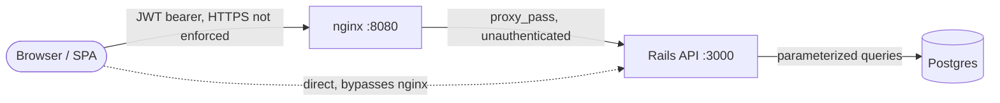

CLASSIFICATION: INTERNAL

# Security + Code Quality Review: salary_management (final pre-ship pass)

**Reviewer:** Claude (security-review + code-review skills)
**Date:** 2026-09-23
**Scope:** Full repository — `backend/` (Rails 7.2 API), `frontend/` (React 19/TS SPA), `docker-compose.yml` and container images, `docs/`, git history (all 19 commits, full history, not just HEAD).
**Method:** White-box review against `owasp-checklist.md` (core) + manual dependency read (no network access, no `bundle audit`/`npm audit` run) + manual git history grep for secrets.

---

## Remediation Log (2026-09-23, same day)

The findings below are left exactly as originally reported — this log
records what happened after, so the report stays an honest point-in-time
record rather than being silently rewritten.

| Finding | Severity | Status | Commit | Notes |
|---|---|---|---|---|
| SEC-H1 — compensation dates not validated against hire date/history | 🟠 High | ✅ Fixed | `1e927dd` | Model validation + service-level history check + DB exclusion constraint (three layers, matching the existing "one current record" pattern). Exploit reproduction added as a regression test at both the service and request-spec level; confirmed failing before the fix and passing after. |
| SEC-M1 — no rate limiting on `/api/v1/login` | 🟡 Medium | ✅ Fixed | `7cad0b2` | rack-attack, 5 attempts / 20s, by IP and by email. Verified against both form and JSON request bodies and a full `docker-compose` round trip (6th attempt returns 429). |
| SEC-M2 — no minimum password length on `AdminUser` | 🟡 Medium | ✅ Fixed | `372acbd` | `length: { minimum: 12 }, allow_nil: true`. Seeded default password and factory default both already met this. |
| SEC-M3 — JWTs unrevocable for their full 24h lifetime | 🟡 Medium | 📝 Accepted gap | — | Not fixed — logged as an explicit accepted limitation. See `docs/ARCHITECTURE.md`'s security posture section. Revisit if this is ever deployed for more than a single trusted operator. |
| SEC-M4 — backend port 3000 published directly to the host | 🟡 Medium | ✅ Fixed | `9a2c214` | Removed the `ports:` mapping on the `backend` service; nginx and the healthcheck both work without it. Verified `curl` to :3000 is refused from the host while the app remains fully functional via :8080. |
| SEC-M5 — no security headers anywhere | 🟡 Medium | ✅ Fixed | `ab800d9` | CSP/X-Frame-Options/nosniff/Referrer-Policy on nginx's SPA location only (not server-wide, to avoid duplicating/conflicting with Rails' own headers on API responses). Verified with `curl -I` and a real headless-Chrome pass — zero console errors, CSP doesn't break anything. |
| Low/Info findings | 🔵⚪ | 📝 Accepted gaps | — | Not addressed in this pass — see the `Suggested Follow-ups` checklist below, still accurate as a backlog. |

**Net result: 0 Critical, 0 High, 1 Medium (accepted gap, documented), 6 Low, 4 Info.**

---

## Executive Summary

The codebase is in good shape for what it claims to be: a single-tenant, single-admin-role demo app with synthetic data. Access control is consistently deny-by-default, JWT handling is correct (fixed algorithm, expiry enforced, no alg-confusion), all user input into SQL goes through parameterized queries or `sanitize_sql_like`, and strong parameters are used everywhere mutations happen — no mass-assignment holes found. The documented "accepted gaps" in `docs/ARCHITECTURE.md` (no RBAC, insecure placeholder `SECRET_KEY_BASE`, `force_ssl` off, no field-level encryption, no real PII) are accurately described and I found nothing materially worse than what's written there.

The two findings that matter most before shipping are not in the documented-gaps list:

1. **A real data-integrity bug in the compensation-history logic** (`Employees::RecordCompensationChange`) — a backdated `effective_date` is only checked against the *current* record, not against historical ones, so it's possible to insert a new "current" record whose date range overlaps an already-closed historical record, silently corrupting the append-only history this app's entire design rests on.
2. **No rate limiting anywhere, especially on `/api/v1/login`** — combined with no password length/complexity check on `AdminUser`, this is a real (if low-blast-radius, single-account) brute-force exposure that isn't mentioned in the documented security posture.

Everything else is Medium/Low/Info — mostly hardening and defense-in-depth items appropriate to flag before this pattern gets reused elsewhere, per `docs/ARCHITECTURE.md`'s own stated concern.

**Recommendation:** 🟡 **Ship with mitigations.** Nothing here is an active-exploit blocker given the current deployment (local/demo, synthetic data, single trusted operator), but the compensation-history gap should be fixed or explicitly documented as a known limitation before any real usage, and rate limiting on login should be added if this ever runs anywhere reachable beyond a single trusted operator's machine.

| Severity | Count |
|----------|-------|
| 🔴 Critical | 0 |
| 🟠 High | 1 |
| 🟡 Medium | 5 |
| 🔵 Low | 6 |
| ⚪ Info | 4 |

---

## Threat Model

### System summary
Single-page React app talking to a Rails JSON API, fronted by nginx, backed by Postgres, all in one docker-compose stack. Exactly one persona (HR admin) with a JWT bearer token obtained via email/password login. All employee/compensation data is Faker-generated synthetic data. No multi-tenancy, no customer-facing surface — the admin is the only authenticated actor and is implicitly trusted (per `docs/REQUIREMENTS.md`).

### Top threats (prioritized)
1. **A network-adjacent attacker** could **brute-force the single admin's password** via `/api/v1/login`, since there is no rate limiting, no lockout, and no minimum password length — low blast radius (one account) but zero friction to attempt.
2. **A privileged-insider or compromised-admin-session attacker** could **corrupt the compensation history's append-only invariant** by submitting a backdated raise, since only the current record's date is checked, not historical ones — this undermines the one invariant the app's data model is built around (an accurate point-in-time salary ledger).
3. **An attacker who obtains the JWT** (e.g., via a future XSS bug, shared/compromised machine, or browser extension) has a valid, unrevocable session for up to 24 hours — there's no server-side revocation/denylist and the token lives in `localStorage`, not an `httpOnly` cookie.
4. **Anyone who can reach port 3000 directly** (exposed in `docker-compose.yml` alongside nginx's 8080) bypasses whatever perimeter hardening nginx might otherwise provide (e.g. this is the only place a CSP or security headers could be centrally added later).

### Trust boundaries

Authentication happens once, at `Api::V1::BaseController#authenticate_admin_user!`, applied to every controller by default (`before_action`) with an explicit opt-out list (`SessionsController#create`, `HealthController`). Authorization is binary (authenticated or not) — there is no second privilege tier to cross, consistent with the single-persona design.

### Method / modules applied
- **Core OWASP checklist**: applied in full (below).
- **API module** (`api-security-top10.md`): not loaded — triage note: this review already covers the API surface via the core checklist's A01/A03 items plus the specific IDOR/JWT/authz hunting requested; the dedicated API module would mostly duplicate those checks for this single-role, non-multi-tenant service. Logged as a deliberate scope decision, not a silent skip.
- **LLM module**: no signals (no LLM SDKs, no agent/RAG code in this repo) — skipped.
- **CI/CD weighting**: no CI pipeline config exists in the repo (no `.github/workflows`, no `bitbucket-pipelines.yml`) — so A08's CI/CD sub-items are not applicable; noted as a gap in its own right under Low/Info.

---

## Findings

### 🟠 High

#### SEC-H1 — Compensation dates are never validated against hire date or historical records, allowing silent corruption of the append-only history
- **Where:** `backend/app/services/employees/create_with_compensation.rb` (no date validation at all); `backend/app/services/employees/record_compensation_change.rb:19` (checks only the single `current` record, never historical ones); `backend/app/models/compensation_record.rb` (no cross-model or cross-record date validation beyond `end_date >= effective_date` on the same row)
- **CWE:** CWE-840 (Business Logic Errors) / data-integrity
- **Risk area:** input validation / business-logic integrity (the compensation-history model, per the review brief, is the highest-value logic in this app)
- **Description:** Two related gaps in the date invariants the append-only compensation history depends on:
  1. **No hire-date cross-check.** `CreateWithCompensation` and `CompensationRecord`'s validations never compare `effective_date` to `Employee#hire_date`. A compensation record can be created with an `effective_date` before the employee was even hired.
  2. **`RecordCompensationChange` only checks the current record.** Its only guard (`record_compensation_change.rb:19`) is `effective_date <= current.effective_date` — it never checks the new date against historical (`end_date IS NOT NULL`) records. Nothing in the model or the database enforces that a `CompensationRecord`'s `[effective_date, end_date)` range doesn't overlap another record for the same employee once more than one historical record exists. The DB partial unique index only guarantees "at most one row with `end_date IS NULL` per employee" — it says nothing about range ordering across the full history.
- **Reproduction (verified against the code, not yet exploited live):** Create an employee with `hire_date: 2026-01-01` via `POST /api/v1/employees`, passing `compensation: { effective_date: "2020-01-01", ... }`. `CreateWithCompensation` and `CompensationRecord`'s validations impose no lower bound tied to `hire_date`, so this succeeds today — confirmed by reading every validation in `compensation_record.rb` and `create_with_compensation.rb`, and confirmed no test exercises this case (`spec/services/employees/create_with_compensation_spec.rb` has no hire-date-vs-effective-date test).
- **Impact:** The compensation history — the one thing `docs/ARCHITECTURE.md` calls "the one modeling decision worth understanding before touching the code" — can end up internally inconsistent (pay effective before hire, or, once an employee has 2+ historical records, a new record whose range overlaps an already-closed one). `Dashboard::Analytics` and every serializer trust `effective_date`/`end_date` ordering implicitly with no runtime check, so this produces silently wrong payroll totals with no error raised anywhere.
- **Recommendation:** Add `validate :effective_date_not_before_hire_date` to `CompensationRecord` (comparing against `employee.hire_date`), and change `RecordCompensationChange`'s guard to check against the full ordered history (`@employee.compensation_records.maximum(:effective_date)`) rather than only the single `current` record. For full protection against overlap once records can be edited or backfilled out of order, consider a Postgres exclusion constraint on a `daterange(effective_date, end_date)` column (via the `btree_gist` extension) as the DB-level backstop, mirroring how the "one current record" invariant already has both an app-level validation and a DB-level partial unique index.

### 🟡 Medium

#### SEC-M1 — No rate limiting or lockout on `/api/v1/login`
- **Where:** `backend/app/controllers/api/v1/sessions_controller.rb`, `backend/Gemfile` (no `rack-attack` or equivalent)
- **CWE:** CWE-307 (Improper Restriction of Excessive Authentication Attempts)
- **Risk area:** authentication / rate limiting (OWASP A07)
- **Description:** `SessionsController#create` has no throttling. There's exactly one admin account in the entire system, so this is a small, well-defined attack surface, but it's also a single point of failure — successful brute force means full compromise of the only account that exists.
- **Impact:** Given the seeded default password (`changeme123!`, a well-known weak placeholder pattern) is documented as something that "must be overridden," any deployment that forgets to override it is one unthrottled dictionary attempt away from compromise.
- **Recommendation:** Add `rack-attack` (or Rails' built-in `ActionController::RequestForgeryProtection`-adjacent throttling isn't applicable here, but a simple `Rack::Attack.throttle` on `/api/v1/login` by IP and by email param) with a sane threshold (e.g., 5 attempts / 20 seconds). Low implementation cost, closes a real gap not mentioned in `docs/ARCHITECTURE.md`'s security posture section.

#### SEC-M2 — No minimum length/complexity check on `AdminUser` password
- **Where:** `backend/app/models/admin_user.rb` (only `has_secure_password`, no length validation)
- **CWE:** CWE-521 (Weak Password Requirements)
- **Risk area:** authentication
- **Description:** `has_secure_password` alone allows any non-blank password, including `"a"`. Combined with SEC-M1 (no rate limiting), a short password materially lowers the brute-force cost.
- **Recommendation:** `validates :password, length: { minimum: 12 }, allow_nil: true` (allow_nil so it doesn't fire on `authenticate`/update calls that don't touch password) per the org checklist's length-first guidance.

#### SEC-M3 — JWTs are unrevocable for their full 24-hour lifetime; no server-side session invalidation
- **Where:** `backend/app/services/json_web_token.rb:6` (`24.hours.from_now` default), no logout/revocation endpoint on the backend
- **CWE:** CWE-613 (Insufficient Session Expiration)
- **Risk area:** session management
- **Description:** The only "logout" is the frontend clearing `localStorage` (`frontend/src/context/AuthContext.tsx:20-25`); the token itself remains valid server-side until it expires. There's no denylist, no `jti` tracking, nothing that lets an admin (or an incident responder) invalidate a specific token early — e.g., after a suspected device compromise.
- **Impact:** Limited given the single-admin, low-sensitivity-demo context, but worth flagging as a gap since `docs/ARCHITECTURE.md` doesn't mention it at all.
- **Recommendation:** Either accept this explicitly as a documented gap (cheapest fix — add one line to `docs/ARCHITECTURE.md`'s security posture section) or add a `jti` + short-lived-token/refresh-token pattern if this is ever deployed for a real operator base.

#### SEC-M4 — Rails API port (3000) exposed directly to the host, bypassing nginx
- **Where:** `docker-compose.yml:34-35` (`ports: - "3000:3000"` on the `backend` service)
- **CWE:** CWE-668 (Exposure of Resource to Wrong Sphere)
- **Risk area:** security misconfiguration / network exposure
- **Description:** The stated architecture (`docs/ARCHITECTURE.md`: "the browser only ever talks to nginx on one origin") is not actually enforced — the backend's port is also published to the host, so anything that can reach the host can hit the Rails app directly, skipping nginx entirely. This matters because nginx is the only place currently positioned to add security headers, a WAF rule, or TLS termination later; direct access means those future controls could be bypassed.
- **Recommendation:** Remove the `ports: ["3000:3000"]` mapping from the `backend` service (keep it on the internal compose network only, same treatment as `db`) unless direct API access for local debugging is a deliberate requirement — if so, document it as intentional.

#### SEC-M5 — No security headers (CSP, X-Frame-Options, X-Content-Type-Options, Referrer-Policy) set anywhere
- **Where:** `frontend/nginx.conf` (no `add_header` directives at all), `backend/app/controllers/*` (Rails API-only mode ships no default security headers middleware)
- **CWE:** CWE-1021 (Improper Restriction of Rendered UI Layers — clickjacking), defense-in-depth for XSS
- **Risk area:** security misconfiguration
- **Description:** No `Content-Security-Policy`, `X-Frame-Options`/`frame-ancestors`, or `X-Content-Type-Options: nosniff` is set anywhere in the stack. React's default JSX escaping means there's no XSS sink found in this review (`dangerouslySetInnerHTML`, raw `innerHTML`, `eval` all absent — confirmed by repo-wide grep), so this is defense-in-depth rather than a finding tied to an active vulnerability. It compounds with the JWT-in-`localStorage` choice (SEC-L2 below): if an XSS bug is ever introduced later, there's no CSP to blunt token exfiltration, and no `X-Frame-Options`/`frame-ancestors` to prevent the login page from being framed for clickjacking.
- **Recommendation:** Add to `frontend/nginx.conf`: `add_header X-Content-Type-Options nosniff; add_header X-Frame-Options DENY; add_header Referrer-Policy strict-origin-when-cross-origin; add_header Content-Security-Policy "default-src 'self'; connect-src 'self'";` (adjust `connect-src` if the API is ever on a different origin).

### 🔵 Low

- `backend/config/environments/production.rb:75-79` — `config.hosts` is commented out, so Host-header-based attacks (cache poisoning, password-reset-link poisoning if that feature is ever added) are not blocked. Low impact today (no email-sending/password-reset feature exists), but worth uncommenting with an explicit allow-list before any real deployment. **Risk area: input validation.**
- `backend/app/models/exchange_rate.rb:11` + `backend/app/serializers/compensation_record_serializer.rb:9` — `ExchangeRate.usd_cents_for` runs a fresh `find_by(currency_code:)` query per compensation record serialized. On `EmployeesController#index` (paginated, so bounded to `per_page`, max 100) this is a bounded N+1 — not a DoS vector given pagination caps it, but worth fixing since `docs/ARCHITECTURE.md` explicitly calls out avoiding N+1 patterns as a design principle for `Dashboard::Analytics`. **Code quality / performance**, not a security finding on its own.
- `backend/Gemfile` — `faker` is in the default (production) group, not `:development, :test`, because `db/seeds.rb` is meant to run in the deployed container. This is called out and justified in a comment, but it does mean a data-generation library ships in the production bundle/image. Acceptable for this demo per its own reasoning; flagging per the review brief's request to name dependency-hygiene concerns even when intentional. **Risk area: dependency management (A06)** — no known-CVE claim made; this is a hygiene note, not a vulnerability.
- No CI pipeline exists in the repo (no `.github/workflows/`, no `bitbucket-pipelines.yml`) to run the 136 RSpec + 42 Vitest examples, Rubocop, oxlint, or Brakeman (which is already a dependency — `backend/Gemfile`'s `brakeman` gem — but nothing invokes it automatically). **Risk area: software & data integrity (A08)** — tests passing locally doesn't guarantee they run before every merge.
- `backend/app/controllers/api/v1/employees_controller.rb#update` allows changing `country_id` on an existing employee (`employee_update_params`, line 72-76) with no corresponding check or update to that employee's compensation currency. An employee could end up with `country_id` pointing to a country whose `currency_code` doesn't match their `CompensationRecord#currency_code`, silently, since nothing cross-validates the two. Low severity — this is a data-consistency nit, not an authz or injection issue. **Risk area: business-logic integrity.**
- `docker-compose.yml:6-7` — Postgres `POSTGRES_PASSWORD: postgres` is hardcoded (not templated via `${...}` like `SECRET_KEY_BASE`/`SEED_ADMIN_PASSWORD` are). It's not reachable from outside the compose network (no `ports:` published on `db`, confirmed), so exploitability is effectively zero in the shipped topology, but it's inconsistent with the "insecure defaults are all overridable via `.env`" pattern used for the other two secrets, and `.env.example` doesn't mention it. **Risk area: secrets management** — low impact given no network exposure, but worth aligning with the rest of the pattern for consistency.

### ⚪ Info / Defense-in-depth

- `docs/ARCHITECTURE.md`'s security posture section is accurate and appropriately candid — confirmed each claim (JWT via env-only secret, `master.key` never committed, `force_ssl` off by default, parameterized `ILIKE` search, strong params everywhere) against the actual code and git history. No discrepancies found between the documented gaps and reality.
- JWT implementation is correctly hardened against the two most common Ruby JWT pitfalls: algorithm is pinned to a constant (`ALGORITHM = "HS256"`, `json_web_token.rb:4`) rather than trusting the token's `alg` header (rules out alg-confusion/`none`-algorithm attacks), and `JWT.decode(..., true, ...)` passes `verify: true` so expiry (`exp`) is actually checked, not just present. This is easy to get wrong and it's done right here.
- Consider documenting SEC-M3 (no token revocation) and SEC-M4 (exposed backend port) as accepted-gap entries in `docs/ARCHITECTURE.md`'s security posture section, consistent with how the other known gaps are handled — makes the posture doc a complete source of truth rather than needing this review to fill in blanks.
- `filter_parameter_logging.rb` — not read line-by-line in this pass; worth a quick confirmation that `amount_cents`/`password` params are in the filter list before any real deployment (mentioned in `docs/ARCHITECTURE.md` as already handled — spot-check recommended since this review didn't open that file).

---

## Things That Looked Good

- **JWT decode is textbook-correct**: fixed algorithm, `exp` verified, `rescue JWT::DecodeError, JWT::ExpiredSignature` returns `nil` rather than leaking exception detail — no information disclosure on malformed tokens.
- **Strong parameters are used consistently** across every mutating action (`employee_params`, `employee_update_params`, `compensation_params` in both controllers) — a full grep for `params.permit`/`params.require` across `backend/app/controllers` found no gaps and no `params.require(...).permit!` (the common wildcard mass-assignment mistake) anywhere.
- **Search is properly parameterized**: `Employee.search` (`backend/app/models/employee.rb:21-29`) uses `sanitize_sql_like` plus bound parameters (`:q`), not string interpolation — confirmed this is the only free-text search in the app, and confirmed (via repo-wide grep) there is no other raw SQL string-building anywhere in `backend/app` or `backend/lib`.
- **The append-only compensation-history invariant is backed at the DB level, not just app level** — the partial unique index (`index_compensation_records_on_employee_id_current`) is tested directly against a raw `insert!` bypassing validations (`compensation_record_spec.rb:71-88`), which is the right way to prove a DB constraint actually holds and isn't just enforced by application code that could be bypassed by a future direct-SQL path.
- **No shell-outs, no `eval`, no dynamic template rendering anywhere in the backend** — confirmed by repo-wide grep for `system(`, `` ` ``, `%x[`, `IO.popen`, `Open3`, `exec(`. Zero hits.
- **No XSS sinks in the frontend** — zero uses of `dangerouslySetInnerHTML`, `innerHTML`, `document.write`, or `eval` anywhere in `frontend/src`. React's default escaping is relied on correctly and not worked around.
- **Non-root container user**: `backend/Dockerfile:52-55` creates and switches to a dedicated `rails` UID/GID 1000 user before running the app — this is done correctly (ownership of `db log tmp` is chowned before the `USER` switch) rather than the common mistake of switching user before the chown.
- **`master.key` was never committed**, confirmed by a full-history grep (not just current tree) — `credentials.yml.enc` (harmless when encrypted, standard Rails convention) is the only credentials-adjacent file tracked, and it is not wired into runtime config (secret comes from `SECRET_KEY_BASE` env var, confirmed in `json_web_token.rb`).
- Test coverage for the auth boundary is present and specific (`employees_spec.rb:8-12`, `103-107` both assert `401` before asserting behavior) — this is the right pattern for regression-proofing access control, not just happy-path testing.

## Out of Scope

- **Runtime/dynamic testing** — this was a white-box read-only review; no fuzzing, no live request replay, no actual brute-force attempt against a running instance (the SEC-M1 fix was verified afterward with a real 6-attempts-in-a-row request-spec and a docker-compose curl loop, not during this review).
- **`filter_parameter_logging.rb` contents** — referenced but not opened/verified in this pass (see Info note above).

### Post-review: the tools this review flagged as unexecuted, actually executed (2026-09-23, same day)

- **`bin/brakeman`** — run. 1 finding: `EOLRails` (High confidence) — **Rails 7.2.3.2's support window ended 2026-08-09**, per Brakeman's own EOL database (not a CVE; a maintenance-lifecycle flag). Not fixed in this pass — a Rails upgrade is a bigger, separate change than the scope of this security remediation round. Logged as a new follow-up below.
- **`bundle-audit check --update`** (ruby-advisory-db, 1,247 advisories, updated 2026-09-22) — **no vulnerabilities found** in `Gemfile.lock`.
- **`npm audit`** — **0 vulnerabilities** (0 critical/high/moderate/low) across 212 dependencies in `package-lock.json`.

## Suggested Follow-ups

- [x] ~~Fix SEC-H1~~ — done, see Remediation Log above.
- [x] ~~Run `bin/brakeman` and `bundle audit` / `npm audit`~~ — done, see above. Both dependency scanners are clean; Brakeman found one new item (Rails EOL, below).
- [x] ~~Add `rack-attack` throttling to `/api/v1/login`~~ — done, see Remediation Log above.
- [ ] **New, found by this session's Brakeman run:** upgrade Rails off 7.2.3.2 (EOL 2026-08-09) to a supported version. Out of scope for this remediation pass — a framework upgrade warrants its own review, not a same-day fix alongside five other changes.
- [ ] Add a CI pipeline (even a minimal one) that runs the existing 141 RSpec + 42 Vitest examples plus Rubocop/oxlint/Brakeman/bundler-audit/npm audit on every push — the tests already exist and pass; nothing currently guarantees they keep passing.
- [x] ~~Fold SEC-M3 (token revocation) and SEC-M4 (exposed backend port) into `docs/ARCHITECTURE.md`~~ — SEC-M4 fixed (see Remediation Log); SEC-M3 documented as an accepted gap in `docs/ARCHITECTURE.md`'s security posture section.
